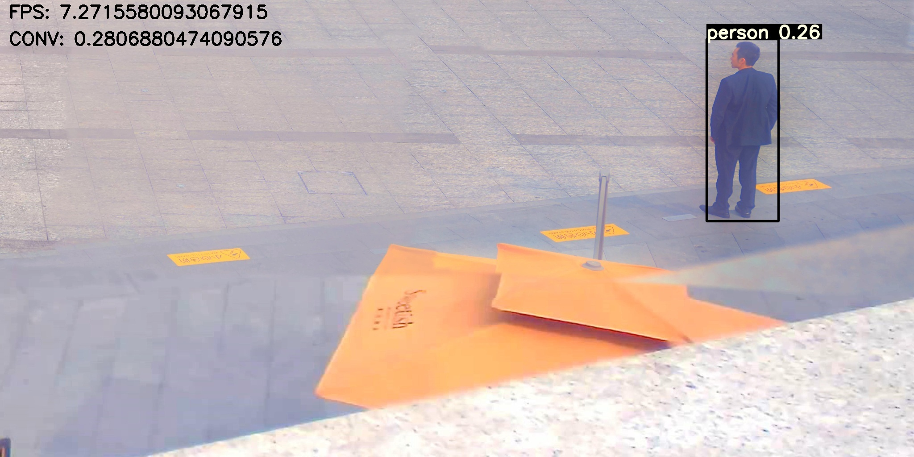
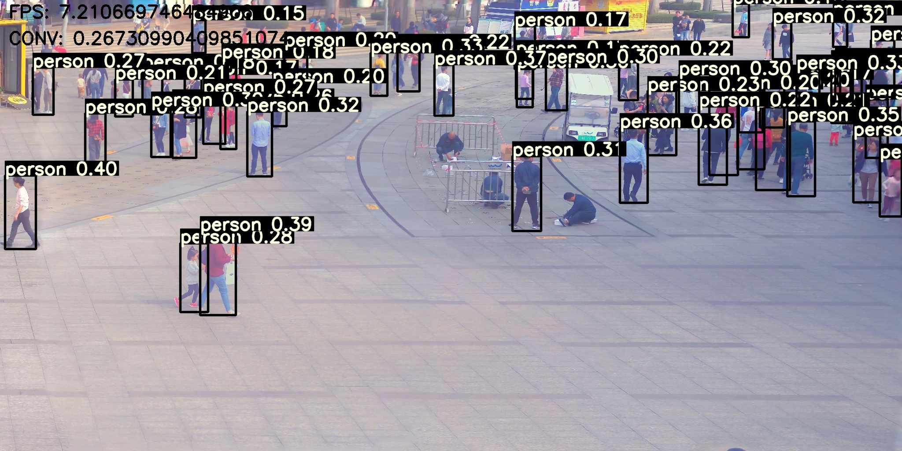
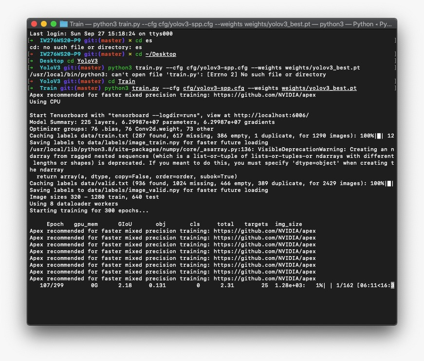

# Project-Template for IW276 Autonome Systeme Labor

This Code is an YoloV3 Person Detection in PyTorch. It works on every common OS.

<p align="center">
  
</p>

> This work was done by Christian Zanner (zach1011), Fernando Pastor Castro (pafe1011), Raphaele Salvatore Licciardo (lira1011) during the IW276 Autonome Systeme Labor at the Karlsruhe University of Applied Sciences (Hochschule Karlruhe - Technik und Wirtschaft) in WS 2020 / 2021. 

This code is adjusted to the projects case in which we had to detect a large number of persons on images and videos
This means the configurations of YoloV3 (the files in the cfg folder) are adjusted to only use one class of objects
and the classes file (classes.names in the data folder) only contains the person class.

## Table of Contents

* [Prerequisites](#prerequisites)
* [Running](#running)
  * [Docker](#docker)
  * [Detection](#detection)
  * [Training](#training)
* [Acknowledgments](#acknowledgments)
* [Contact](#contact)

## Prerequisites
Install requirements:
```bash 
$ pip install -r requirements.txt
```
Start Docker Daemon on Jetson Nano
```bash
$ sudo service docker start
```

## Running

Descriptions about the main Topics of this Project, e. g. the Training Part of our A.I.

### Docker 

This Project doesn't own a mounted Folder for the Docker Container. So if you start this Project in the Docker Container and want to watch the Output Pictures of the Detection (e. g. the BBoxes), you need to do the following steps:
1. Copy the Images from your Docker to your Host Machine (here: Jetson Nano via SSH)
```bash
sudo docker ps
sudo docker cp <container_id>:<docker_output_folder> <host_target_folder>
```
2. If you run it with the Jetson Nano via SSH and now want to Copy those Images to your Running Working Machine you need to do following Command:
```bash
scp -r <name>@<ip>:<remote_output_folder> <local_target_folder>
```

You also can run the Connection to the Jetson Nano via `ssh -X`, so you don't need those commands. In our case it was more comfortable to use this, instead of `ssh -X` or an mounted Docker Folder.

Basic Docker Commands:

**Build Container** To build the Docker Container from the Dockerfile (on the Jetson Nano) run the following Command.
```bash
sudo docker build --no-cache . -t <image_name>
```

**Run Container** To run the Docker Container from the Docker Image run the following Command.
```bash
sudo docker run -it --rm --runtime nvidia --network host <image_name>
```

### Detection

<p align="center">
  
</p>

This part of the Project, doesn't need any big Changes. 

1. Download all the Files which are not in this Part of the Repository Included. (If you go with Docker, the Dockerfile make the following Command by it self - Jump to 2.)
```bash
$ bash get_remaining_data.sh
```

2. Now you own every File, which are necessarly for the `detect.py`. If you downloaded all files correctly you should be able to start the default YoloV3 Person Detection with the following command:
```bash
$ bash detect.py 
```
If there are any mistakes, you want to set your own files or you want to start the YoloV3-Tiny Person Detection, you have to do it his way:
```bash
$ bash detect.py --cfg <path_to_config_file> --weights <path_to_weights_file> --names <path_to_names_file> --source <path_to_image_folder> --output <path_to_output_folder>
```
You are able to use more Arguments, just watch Line 158 - 174 in the `detect.py` File or change the default settings.

### Training

**Prepare Training**

We absolutely recommend starting your training with already pretrained weights. Even if your case might be different from the usual detection you should use pretrained weights.
Some of those weights already have many weeks of training behind them and will definitely improve your overall detection rates.

For YoloV3 `yolov3-spp-ultralytics.pt` is a really well trained weight file and `yolov3-tiny.pt` for Tiny YOLOv3

 [Download](https://drive.google.com/open?id=1LezFG5g3BCW6iYaV89B2i64cqEUZD7e0)

> *Side information: pt stands for pytorch. With our code you can also use .weights file but we decided to use Pytorch instead of Darknet, so we rather use pt files and also save the resulting weights as pt files.*

**Prepare your Custom Data** 

For this you should do the 7 steps in the chapter [Train On Custom Data](https://github.com/ultralytics/yolov3/wiki/Train-Custom-Data). 
But before you start we want to mention that we created two small Python3 scripts to make some of the steps easier. 
The first one is `index.py`. It takes all the image files in data/images/train and data/images/valid and creates the necessaey image lists train.txt and valid.txt

```bash
$ python3 index.py
```

The second is `annos_converter.py`. For our Project we got a PANDA Dataset for which all the the Bounding Boxes for all objects and images were saved in a single big json file.
We created a small script to put all the Bounding Boxes for each image (in given path --image_path) into seperate files in the format necessary for `train.py`
We also change the formats of the panda coordinates (x_topLeft y_topLeft, x_bottomRight, y_bottomRight) to the darknet format (x_centter, y_center, width, height)
Since in our case we needed the bounding boxes "visible body" of persons this part is hardcoded to look for those bounding boxes. 
If you need to detect different objects you probably have to adjust the script.

```bash
$ python3 annos_converter.py --annos_path data/image_annos/person_bbox_valid.json --images_path data/images/image_valid/*.jpg
```


**Start Training:** 

To begin training after preparing training and validation data

```bash
$ python3 train.py --cfg <your_cfg_path> --weight <pretrained_weight_path>
```

The default config is `cfg/yolov3-spp.cfg` (or `cfg/yolov3-tiny.cfg` if `--tiny` is set) so if you just adjusted this config to your requirements then you don't have to add `--cfg`.
Check the arguments of train.py to adjust it to your requirements
e.g. change img_size and add multi-scale to do you training in different image sizes practical to object detection in which the objects have a lot of different sizes

```bash
$ python3 train.py --cfg <your_cfg_path> --weight <pretrained_weight_path> --img_size [320, 1280, 640] --multi-scale
```

**Resume Training:** 

to resume training from `weights/last.pt` (or `weights/last_tiny.pt` if `--tiny` is set).
```bash
$ python3 train.py --resume --cfg <your_cfg_path>`
```
don't forget to add your additional arguments here like img_size or multi-scale

<p align="center">
  
</p>

Again, the default config file is `cfg/yolov3-spp.cfg` (or `cfg/yolov3-tiny.cfg` if `--tiny` is set)

>In those Pytorch files the number of epoches run and the currently best evaluation is also saved, so if for some reason the training is stopped, 
you can easily continue from where the training left of with --resume. 

**Results** 

After each epoch `last.pt` (or `last_tiny.pt`) will be updated and if the evaluation of the current neural net is the best `best.pt` will be overwritten.
Also a result.txt if created in whích for each evaluation the results are saved. If you want to analyze the evaluation data we recommend plotting with the following commands.

```bash
from utils import utils
utils.plot_results()
```

<p align="center">
  
</p>

> The results of the plotting will be saved in a `results.png` file.

If you want to learn how the object detection is evaluated we recommend taking at this stunning [Medium Article](https://medium.com/analytics-vidhya/understanding-the-map-mean-average-precision-evaluation-metric-for-object-detection-432f5cca53b7)

## Acknowledgments

This Repository is based on:
  - [ultralytics](https://github.com/ultralytics/yolov3), owns an Repository, which was our main inspiration to build an YoloV3 based KI for Person Detection.
  - [eriklindernoren](https://github.com/eriklindernoren/PyTorch-YOLOv3), also and Repository as our secound inspiration.
  - [pjreddie](https://pjreddie.com/darknet/yolo/), delivery of YoloV3 and YoloV3-Tiny Network.
 
Thanks to the original authors for their work!

## Contact
For further Questions please email one of them:
* <a href="mailto:frimickael.cormier@iosb.fraunhofer.de">Mickael Cormier (Lecturer)</a>
* <a href="mailto:pafe1011@hs-karlsruhe.de">Fernando Pastor Castro (Student 1 - Training)</a>
* <a href="mailto:zach1011@hs-karlsruhe.de">Christian Zanner (Student 2 - Training)</a>
* <a href="mailto:lira1011@hs-karlsruhe.de">Raphaele Salvatore Licciardo (Student 3 - Detection)</a>


